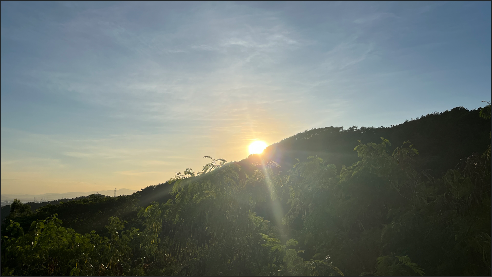

# 你好，我是 鸭鸭「カモ」!
我正在写一些有趣的东西，具体请见我固定的仓库 :)  
偶尔参与[ WinGet 包社区](https://github.com/microsoft/winget-pkgs)的贡献。  

> [English Page](https://github.com/DuckDuckStudio/DuckDuckStudio/blob/master/README.md)  

喜爱旅行、摄影。  
以及一些可能比较小众的爱好：[音游](https://baike.baidu.com/item/音乐游戏/906300)、[公共交通](https://www.zhihu.com/question/2020412853006386723)、听[FM 电台](https://duckduckstudio.github.io/Articles/如何怎样/radio.html)、读报。  

  

  

前往我的个人网站查看更多信息 → [https://duckduckstudio.github.io/yazicbs.github.io/](https://duckduckstudio.github.io/yazicbs.github.io/)  
