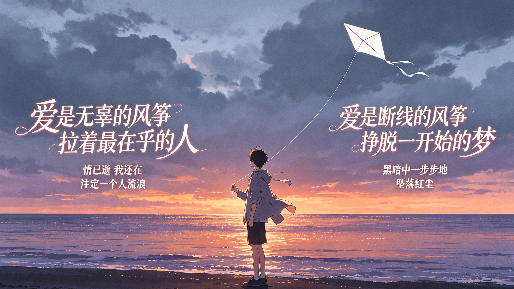

# Hello, I am 鸭鸭「カモ」!
[点我查看简体中文页面](https://github.com/DuckDuckStudio/DuckDuckStudio/blob/master/README-zh.md)

I am writing some interesting stuff, see my pinned repository for details :)  
Sometimes contribute to the [WinGet Package Community](https://github.com/microsoft/winget-pkgs).

Loves traveling and photography.  
As well as some hobbies that might be a bit niche: [Rhythm games](https://baike.baidu.com/item/音乐游戏/906300), [public transportation](https://www.zhihu.com/question/2020412853006386723), listening to [FM/AM radio](https://duckduckstudio.github.io/Articles/如何怎样/radio.html).  

> The lyrics in the illustration are from the song《无辜》on Gary Chaw's 2007 album _Super Sunshine_.
> In 2008, this song was awarded the _Top 20 Most Popular Songs (最受欢迎20大金曲)_ prize at the 8th _Global Chinese Music Awards_, and even though more than a decade has passed, Music Radio (总台音乐之声) still plays this song today.
> _This illustration was generated by AI._

  

Check out my personal page for more information: [https://duckduckstudio.github.io/yazicbs.github.io/](https://duckduckstudio.github.io/yazicbs.github.io/)
