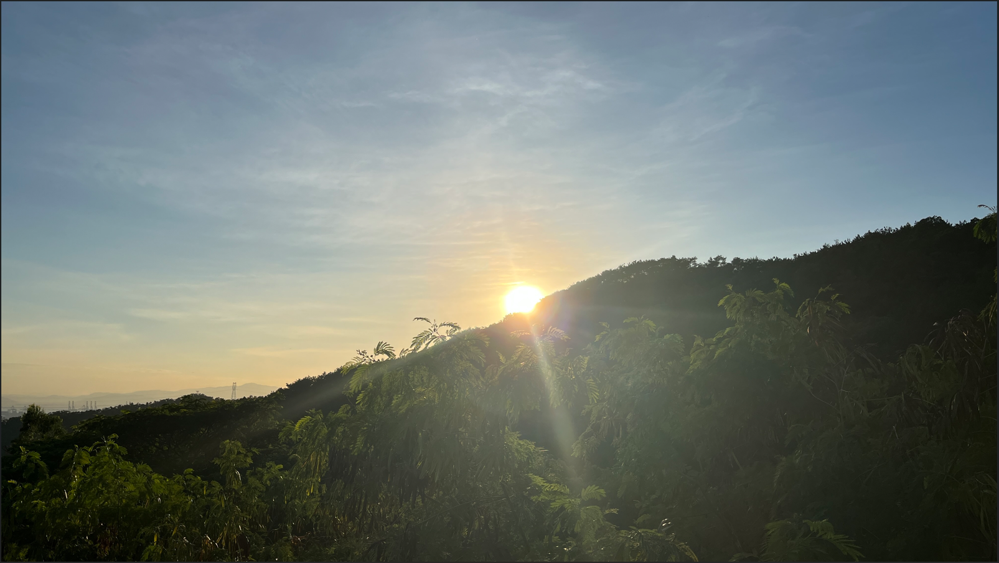

# Hello, I am 鸭鸭「カモ」!
I am writing some interesting stuff, see my pinned repository for details :)  
Sometimes contribute to the [WinGet Package Community](https://github.com/microsoft/winget-pkgs).  

> [简中 Page](https://github.com/DuckDuckStudio/DuckDuckStudio/blob/master/README-zh.md)  

Loves coding, traveling and photography.  

## My Github stats:  

|  |  |
|-----|-----|

  

Check out my personal page for more information: [https://duckduckstudio.github.io/yazicbs.github.io/](https://duckduckstudio.github.io/yazicbs.github.io/)
